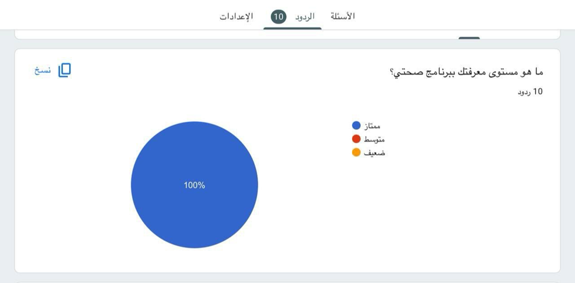
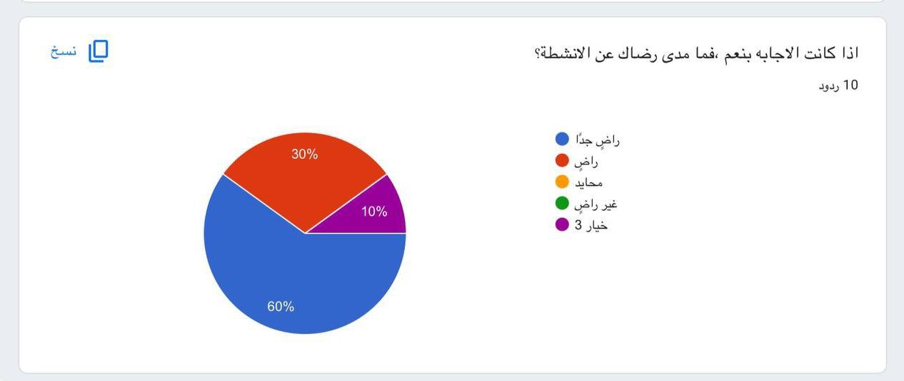
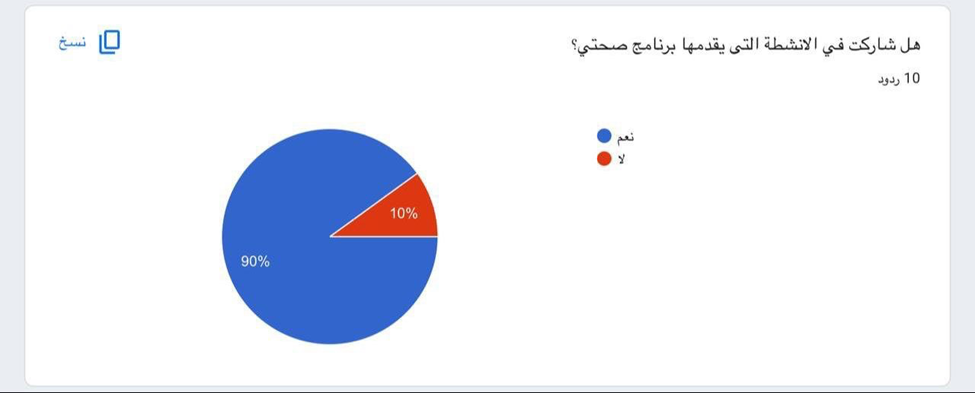
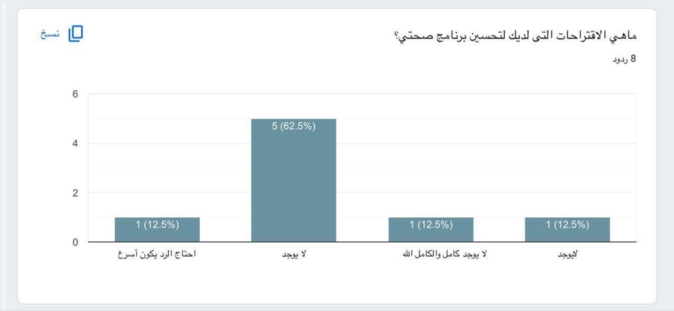
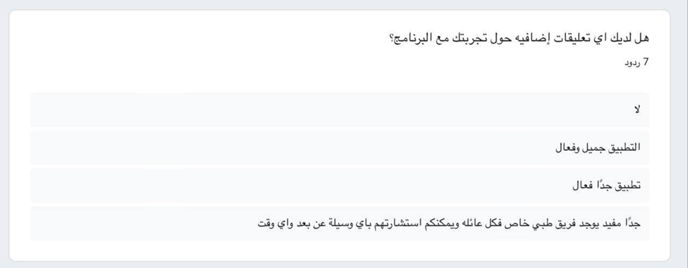

**Software Documentation and Technical**

**Sehhaty Software Application**

**Students Names :**

| Thekra Abdullah | 444010294 |
| --- | --- |
| Abeer Al-Arayani | **444001781** |

"Sehhaty" Software Application

It is a health application that aims to facilitate access to health services in the Kingdom of Saudi Arabia. This application aims to improve the user experience in obtaining health care and providing various health services. Sehaty is an application launched by the Saudi Ministry of Health to provide health services to individuals in the Kingdom of Saudi Arabia. It allows the user to access health information and obtain a number of health services provided by various entities in the health sector in Saudi Arabia. The Sehaty application is one of the most prominent applications launched during the Corona Covid-19 pandemic.

# Requirements of Sehhaty

# Functional Requirements

- Create a user account: The application allows the ability to register a new user and log in.
- Book appointments: Provides a service to book appointments with doctors and hospitals easily.
- Access medical records: Allows users to view their medical records.
- Order medications: Allows users to order medications from pharmacies.
- View test results: Provides users with the ability to view test and examination results

# Non-Functional Requirements

- Security: The application must ensure the protection of user data from unauthorized access.
- Ease of use: Requires a simple and easy-to-interact user interface design.
- Performance: The application must be fast and operate efficiently.
- ---

### 2. Main Tasks

The Sehhaty software performs the following tasks:

- **Appointment management**: Organizes and books medical appointments.
- **Access to health information**: Provides users with health information and educational resources.
- **Communication with healthcare providers**: Facilitates communication between users and doctors.
- **Personal health tracking**: Enables users to track their health status and changes.

---

### 3. Purpose of Sehhaty app:

The Sehhaty app helps users track their health and fitness by recording sports activities, diet, steps, and weight. It provides reports to understand users' healthy lifestyle.

#### 3.1 Features:

- Store and track health data such as medical records, tests, etc.
- Schedule appointments with doctors through the app.
- Access reliable health information to make informed health decisions.
- Medical consultations for easy access to health information.
- Health alerts for medication schedules.

#### 3.2 Problems Solved by the Application:

- Lack of unified health records leading to loss of important health information.
- Limited communication with healthcare providers affects the quality of healthcare.
- Difficulty obtaining remote medical consultations before the Sehhaty app.
- Managing medication schedules.

---
1. Existing Systems

# Mawid App

**Advantages of Mawid App:**

- Ease of booking appointments: The app allows users to book appointments in hospitals and government health centers with ease, saving users the trouble of going to health facilities in person.
- Appointment management: Users can easily modify or cancel their appointments through the app, which contributes to better flexibility in time management.
- Appointment reminders: The app sends appointment reminders to users, reducing the possibility of forgetting medical appointments.
- Various health services: In addition to booking appointments, users can benefit from other services such as self-assessment of symptoms and access to medical records.

**Disadvantages of Mawid App:**

- Limited available appointments: Sometimes, users may face a problem in finding available appointments nearby, especially in health facilities that are experiencing high pressure.
- Technical issues: Some users occasionally experience technical issues with the app, such as it stopping working or having difficulty accessing the required services.
- Requirement of an Internet connection: The app requires a constant Internet connection to work, which may be inconvenient for users who do not have a stable Internet connection.
- Lack of support for some health facilities: In some cases, not all health facilities may be included in the system, which limits users’ ability to book appointments at the nearest health center.

**What distinguishes our application from Mawid applications is:**

Scope od Servicers :

- Sehhaty: Provides comprehensive health services that include a wide range of features such as:
- Viewing medical records and health reports.
- Tracking medications and medical appointments.
- Remote medical consultations.
- Services such as booking appointments for corona examinations, viewing vaccination status and vaccines.
- Tracking physical activities and health indicators such as weight, height, and blood pressure.
- Mawid: It mainly focuses on booking appointments at health centers and hospitals affiliated with the Ministry of Health. It provides services for booking, modifying, or canceling appointments, with some complementary tools such as symptom assessment.

Remote health services:

- Sehhaty: It features remote medical consultation services, where users can communicate with certified doctors and obtain medical consultations from home, which is an important feature that contributes to facilitating access to health care.
- Mawid: It does not provide this service, but rather focuses more on booking appointments at health facilities.

Health Records :

- Sehhaty: Provides access to users'’personal health records, including information about laboratory tests, medical reports, vaccinations, and prescriptions. It is considered a comprehensive center for displaying all personal health data.
- Mawid: It does not provide this feature in an integrated manner, and focuses more on managing appointments only.

Integration of services with health systems:

- Sehhaty: It is more integrated with various health systems in Saudi Arabia, such as linking it to platforms such as Tawakkalna to follow up on the status of vaccinations and the Corona pandemic. It also allows users to interact with multiple services within the framework of public health.
- Mawid: It mainly focuses on booking and managing medical appointments without integration with broader health services such as health tracking or reports.

Monitoring health indicators:

- Sehhaty: It allows users to monitor their health indicators such as activity levels, blood pressure, and heart rate, making it more integrated in monitoring personal health status.
- Mawid: It does not include this feature. Its focus is on appointments and related health services.

Target group:

- Sehhaty: It targets all citizens and residents who wish to monitor their health on a daily basis and includes multiple services related to public health care.
- Mawid: It mainly targets people who need to book appointments for medical visits in government health facilities.

# Babylon Health App

**Advantages of the Babylon Health app:**

- Remote medical consultations: Provides quick access to doctors through video calls or text chat, reducing the need to visit clinics.
- Artificial intelligence for symptom assessment: Relies on artificial intelligence to provide an initial assessment of symptoms and guide patients on the next steps.
- Digital medical record: Provides a digital record through which users can track their health history and review previous tests and diagnoses.
- Flexibility of use: Services can be accessed anytime and from anywhere, making it suitable for people who are busy or who prefer virtual consultations.

**Disadvantages of the Babylon Health app:**

- Limitations of artificial intelligence: AI-based assessment may not be accurate in all cases, especially if symptoms are complex.
- Costs: Direct consultations with doctors can be expensive if they are not covered by health insurance.
- Geographical limitations: Some features may not be available in all countries, as the app depends on the availability of local doctors and partners.

**What distinguishes the Sehaty app from Babylon Health:**

- Integration with government health services: The Sehaty app is directly connected to the Saudi Ministry of Health, which facilitates booking appointments in government hospitals and accessing official medical examinations and reports.
- Free for citizens and residents: All services provided by the app are free and include basic healthcare, which makes it more convenient for users in Saudi Arabia.
- Vaccination and early detection file management: It provides services related to registering vaccines such as the Corona vaccine, and provides notifications about preventive examinations and early detection.
- Travel permits and health procedures: During the Corona pandemic, it played an important role in issuing health and travel permits, in addition to tracking the status of the vaccine

**A distinctive comparison that is similar to my health, which is Apple Health in terms of features and drawbacks:**

Features of the Healthy Health app (Apple Health):

- Collecting health data: Collecting information about your activity, heart rate, sleep, nutrition, and others.
- Integration with devices: Integrates with Apple devices such as Apple Watch and fitness trackers.
- Attractive user interface: Simple and easy-to-use design, creating access to information.
- Sharing data: Ability to share medical information with instructions or other applications.
- Personalizing data: Screens can be customized to display the information most important to the user.

**Disadvantages:**

- Limited compatibility: - Available only on iOS devices, which limits accessibility for guests.
- Reliance on Apple devices: - For the best experience, it is best to use Apple devices such as Apple Watch.

**What distinguishes our application from similar applications is:**

- Various health services: - Provides services such as requesting appointments, viewing results, and managing vaccinations.
- Health information: It has comprehensive information about diseases, symptoms, and conditions.
- Integration with the Ministry of Health: - Protection with local health systems and coverage of services directly from the Ministry of Health.
- Arabic User Interface: - Fully supports the Arabic language, which makes it easy to use for users in Saudi Arabia.
- Conclusion -Healthy app is an excellent choice for Apple users who want comprehensive health tracking and integration with smart wearable devices.
- However, the Sehaty app is a strong choice for active Saudi users looking for reliable health services and reliable medical
---
### 5. Questionnaire

We conducted a survey to assess the effectiveness of Sehhaty services among app users.

---
### 6. System Architectures And Data Models

#### 6.1 Use Case Diagram

The use case diagram outlines a comprehensive set of interactions within the Sehhaty system, showcasing how patients and healthcare providers use the platform for health management and communication.

#### 6.2 Activity Diagram

This diagram illustrates how users interact with Sehhaty from login to performing various tasks such as booking appointments, ordering medications, and viewing health records.

#### 6.3 System Architecture

Sehhaty’s architecture is based on distributed services and cloud technologies, with the following layers:
- **Front-end**: User interaction layer.
- **Back-end**: Manages requests and provides results.
- **Database Layer**: Stores user data, appointments, and health records.
- **Integration Layer**: Connects to hospital and pharmacy systems.
- **Security Layer**: Ensures data and communication protection.

#### 6.4 Hardware Requirements

- **Servers**: Cloud-based or on-premises (e.g., AWS EC2, Azure VMs).
- **Networking Devices**: Routers, network adapters.
- **Storage Systems**: Secure cloud storage (e.g., AWS S3, Google Cloud).
- **Firewalls and IDS**: For network security.

#### 6.5 Software Requirements

- **Backend Frameworks**: Spring Boot, Django.
- **DBMS**: MySQL, PostgreSQL.
- **Cloud Services**: AWS, Microsoft Azure.
- **Security Software**: SSL/TLS for encryption.
- **Monitoring Tools**: Prometheus, ELK Stack.

#### 6.6 Cloud Architecture

Sehhaty leverages cloud services for high performance:
- **Compute**: AWS EC2 or Azure VMs for back-end services.
- **Storage**: AWS S3 or Azure Blob Storage for large files.
- **Networking**: Secure networks using AWS VPC or Azure Virtual Network.
- **Security Services**: AWS Shield, AWS IAM.

#### 6.7 Database Requirements

- **Users Table**: Stores user details like UserID, Name, Email, etc.
- **Appointments Table**: Stores appointment details like AppointmentID, UserID, DoctorID, etc.
- **MedicalRecords Table**: Stores medical records.
- **PharmacyOrders Table**: Stores medication orders.
- **Hospitals Table**: Stores hospital details.

**Relationships between tables**:
- One user can book multiple appointments.
- A user can have multiple medical records.
- A user can order multiple medications.

**Database Type**: Relational DB (e.g., MySQL, PostgreSQL).
- **Data Security**: Encryption for data at rest and in transit.
- **Access Control**: Role-based permissions.
- **Backup and Recovery**: Regular backups for service continuity.
- **Scalability and Performance**: Partitioning or sharding, indexes for fast data access.
- **Health Standards Compliance**: HL7, FHIR for integration with hospital systems.
